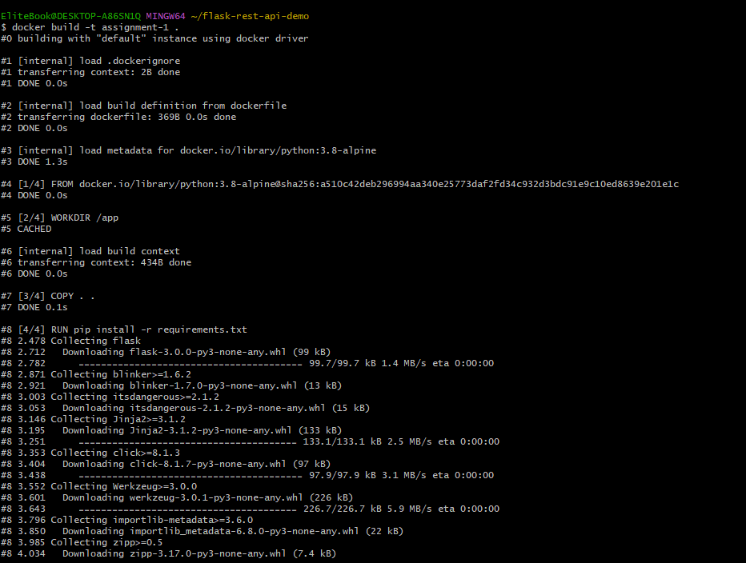
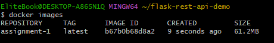
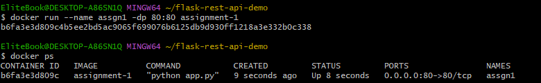
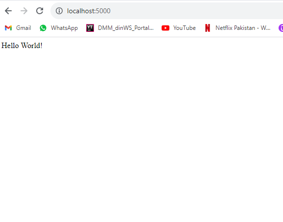
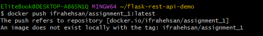
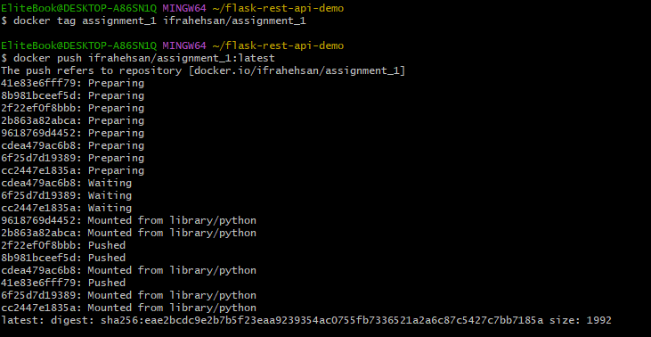
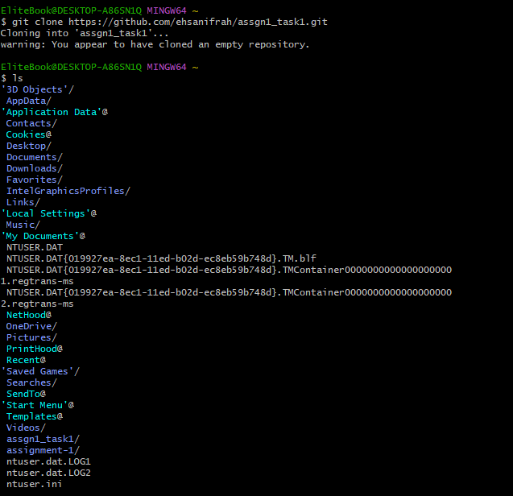
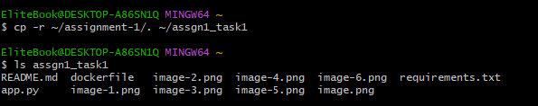
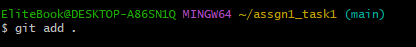
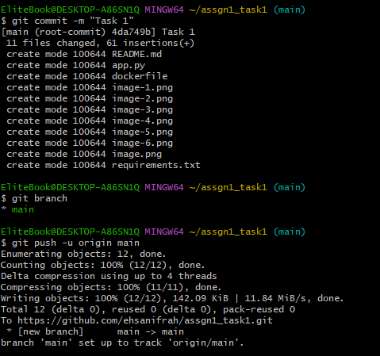

# Assignment 1 - Task-1

## Docker File
- FROM: included base image using FROM
- WORKDIR: created a working directory app
- COPY: copied all source code files
- RUN: install all dependenices using RUN
- CMD: using cmd as an application startup point

## Image Build
build an image using command ( docker build -t assignment1 . )

view image using command ( docker images)

## Run Container
run a container ( docker run --name assgn1 -dp 5000:5000 assignment1 ), here

- container name: assgn1
- port: 5000
- d means running in background

view running container ( docker ps)

## Web Output

## Docker Image to Docker Hub
pushed docker image to docker hub
- created repository on docker hub  ( ifrahehsan/assignment_1) and run this command ( docker push ifrahehsan/assignment_1:latest) and got the following error

and after that i have runned these commands and got the following output:

- docker tag assignment_1 ifrahehsan/assignment_1 

- docker push ifrahehsan/assignment_1:latest

## Git Repository
I have created git repository and the clone it by using command:

and then i have copied all files from previous folder to to git repository folder by command:

change directory and then add all files to staging state:

commit code and push it
